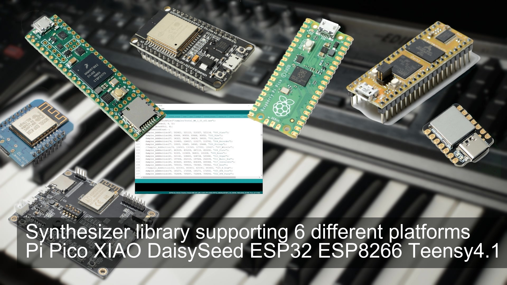

<h1 align="center">esp32_esp8266_organ</h1>
<h3 align="center">ESP32, ESP8266 this is an older version (little example arduino project)</h3>  

 
   
  <a href="https://youtu.be/c7TL8jcrnzs">link to the video</a>

I mixed up this "fork" until it was working on esp32 a1s audio kit v2.2 hardware with midi serial
The required library can be found here: https://github.com/marcel-licence/ML_SynthTools

Demo using the XIAO: https://youtu.be/2wT8nByoUNw
Demo using the Teensy4.1: https://youtu.be/H-NDCQnSDV0

more information available in future
